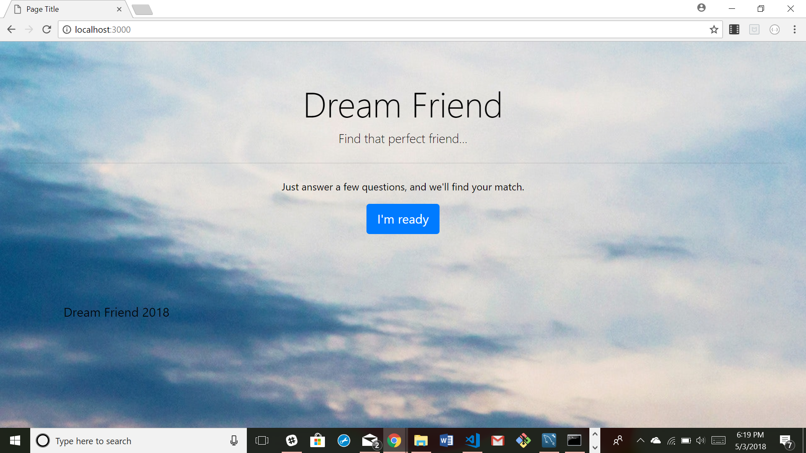
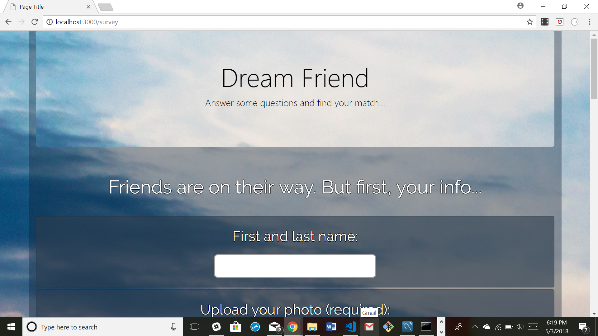
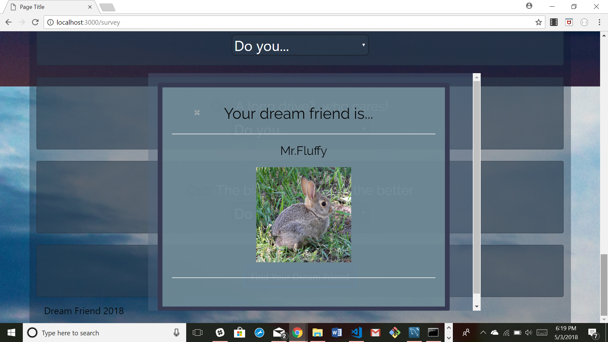

# friendfinder

This project was created by Jaime Halupka as a requirement for homework during University of Central Florida's Coding Bootcamp. 

### Screenshots

### Description

Dream Friend invites a user to answer 10 question and matches them with a 'friend' who has the most similar answers from a list. The user's info (photo and name) are then pushed to the list. User data is not persistent.

### Link to Application

[Heroku Link](https://stormy-scrubland-14737.herokuapp.com/)

### GIFs

[GIF Link](https://gfycat.com/gifs/detail/DelectableLazyButterfly)

### Node Packages Used

* express
* body-parser
* path
